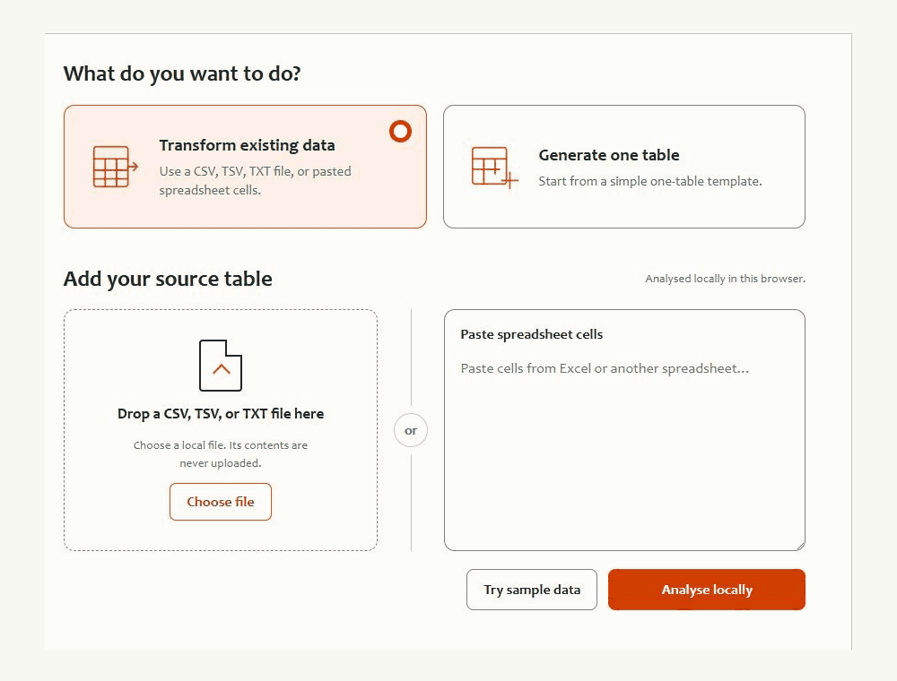
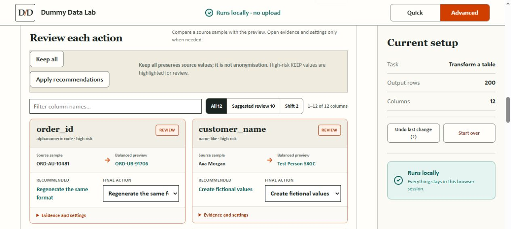

# Dummy Data Lab

**Turn existing CSV, TSV, or delimited TXT data into controlled dummy datasets—or generate new test data—in one offline HTML file.**

[**Use Dummy Data Lab online**](https://timliu724.github.io/dummy-data-lab/) · [**Download Dummy Data Lab V1.70**](https://github.com/timliu724/dummy-data-lab/releases/download/v1.70/Dummy-Data-Lab-v1.70.html)

**No installation · No data upload · Runs locally in current Chrome or Edge**

The online version is served by GitHub Pages; source data is still processed locally in your browser. Download the HTML file for use without an internet connection.

**Quick mode:** turn source data into downloadable test data in a few guided steps.



## Quick start

1. Open the [online version](https://timliu724.github.io/dummy-data-lab/), or download `Dummy-Data-Lab-v1.70.html` for offline use.
2. If downloaded, open the HTML file in Chrome or Edge.
3. Choose **Quick** for an existing table or a new single table, or **Advanced** for detailed controls and related tables.
4. Upload or paste data, or select **Try sample data**, then choose **Analyse locally**.
5. Review the proposed actions, generate the result, inspect the Quality Report, and download the output.

Use only source data you are authorised to process, and review generated output before sharing it.

## What it does

Use **Quick** for the shortest path from source data to output. Switch to **Advanced** when you want to inspect source-to-preview changes and control individual column actions.



### Quick

Quick keeps the main workflow compact and guided:

- transform an existing CSV, TSV, TXT, or spreadsheet paste;
- inspect recommendations before generation;
- generate a single table from editable People, Orders, or Support Cases starters;
- add custom columns or remove default fields;
- preview more rows, inspect the Quality Report, and export locally.

The fictional 16-row, 12-column sample is loaded visibly into the input area and is not analysed until you choose **Analyse locally**. An uploaded file safely supersedes an unchanged built-in sample. If an upload and user-authored pasted data are both present, the application asks which source to use without deleting either one.

### Advanced

Advanced retains the complete data engine and adds detailed policy settings, relationship controls, saved configurations, optional TSV export, and multi-table generation. Its connected-commerce sample demonstrates People, Products, Orders, and Appointments with primary keys, foreign keys, dependent fields, and linked dates.

## Core capabilities

- **Stable mappings:** repeated source values can receive consistent replacements within the selected scope.
- **Field-level strategies:** keep, replace, pattern-replace, shift, resample, generalise, sanitise, clear, or drop columns.
- **Useful distributions:** bounded numeric distribution evidence can guide resampling.
- **Evidence-based relationships:** only user-confirmed relationships control generation and validation.
- **Business-pattern controls:** choose Flexible, Balanced, or High match handling for supported source structure.
- **Quality reporting:** distinguish `PASS`, `REVIEW`, `FAIL`, and `NOT EVALUATED` results.
- **Linked datasets:** generate and validate related tables, including configured primary and foreign keys.
- **Local exports:** download CSV, optional TSV, JSON reports and configurations, or related-table ZIP archives.

## Privacy boundary

The standalone HTML is self-contained. Its Content Security Policy disables outbound connections, and the application includes no analytics or telemetry. Source rows are processed in the current browser session and are not uploaded by the application.

Dummy Data Lab provides practical masking, sanitisation, pseudonymisation, and rule-based test-data generation. It is not certified anonymisation, a differential-privacy implementation, or a statistical or machine-learning synthetic-data model. A passing Quality Report applies only to evaluated contracts and is not a privacy certification.

Read [Security and Privacy](docs/SECURITY_PRIVACY.md) and [Known Limitations](docs/KNOWN_LIMITATIONS.md) before sharing generated output.

## Input and output

**Input:** CSV, TSV, delimited TXT, or cells pasted from a spreadsheet. Direct XLSX import is not supported.

**Output:** CSV, optional TSV, JSON quality reports and configurations, and ZIP archives for related-table projects.

Sample files are available in [`demo/`](demo/).

## Documentation

- [User Guide](docs/USER_GUIDE.md)
- [Security and Privacy](docs/SECURITY_PRIVACY.md)
- [Known Limitations](docs/KNOWN_LIMITATIONS.md)
- [Release Notes](docs/RELEASE_NOTES.md)
- [V1.70 Release Verification](docs/V1.70_RELEASE_VERIFICATION.md)
- [Offline Security Audit](docs/OFFLINE_SECURITY_AUDIT.md)
- [Changelog](CHANGELOG.md)
- [Third-party Licenses](docs/THIRD_PARTY_LICENSES.md)

## Development

Development requires Node.js 24 or later and npm.

```bash
npm install
npm run build
npm run audit:offline
```

Maintainable source is under [`src/`](src/), and the public build utilities are under [`scripts/`](scripts/). The standalone application itself does not require Node.js or npm.

## Support and license

Use [GitHub Issues](https://github.com/timliu724/dummy-data-lab/issues) to report a bug, ask a usage question, or suggest an improvement.

Dummy Data Lab is released under the [MIT License](LICENSE). Third-party components retain their own licenses; see [THIRD_PARTY_NOTICES.md](THIRD_PARTY_NOTICES.md) and [`licenses/`](licenses/).
